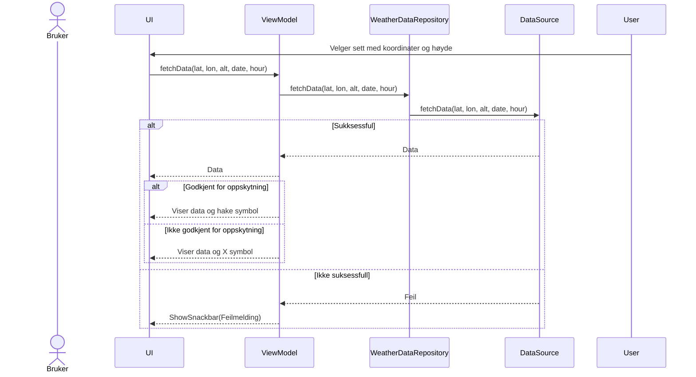
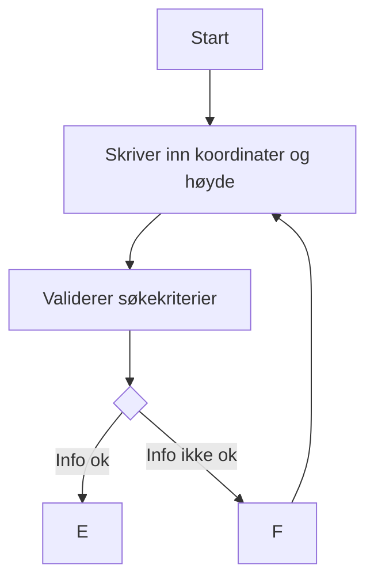

# Sekvensdiagram 

    
# Use Case 1

## Tekstlig beskrivelse av use case

**Primæraktør**: Brukeren: En person som ønsker å få en værmelding for et bestemt sted, tidspunkt og høyde for å sjekke om det er mulig å skyte opp en rakett.  
**Prebetingelse**: Brukeren må ha tilgang til applikasjonen, og UI-et må være klart til å motta brukerinput.  
**Postbetingelse**: Brukeren har blitt presentert med den ønskede informasjonen for det valgte stedet, tidspunktet og høyden, sammen med et resultat som indikerer om det er mulig eller ikke å skyte opp en rakett.  

**Hovedflyt**:
<ol>1. User chooses a set of coordinates, time and, if wanted, altitude. Presses search. </ol>
<ol>2. System validates coordinates</ol>
<ol>3. System fetches forecast data</ol>
<ol>4. Returns forecast data for the given informations</ol>
<ol>5. Shows a checkmark if it is possible to launch a rocket</ol>

**Alternativ flyt**:  
<ol>2.1: Koordinatene blir ikke validert</ol>
<ol>2.2: Bruker skriver inn gyldige koordinater på nytt</ol> 
<ol>3.1 Systemet mislykkes i å hente data</ol>
<ol>3.2 Returnerer feil</ol>
<ol>3.2 Viser snackbar til brukeren</ol> 
<ol>5.1 Viser et X-merke hvis det ikke er mulig å skyte opp en rakett</ol>

# Aktivitetsdiagram

