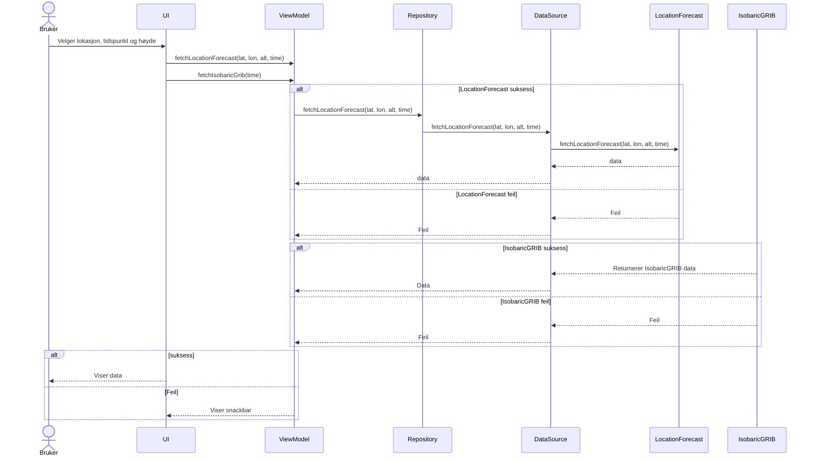

# Sekvensdiagram 

    
# Use Case

## Tekstlig beskrivelse av use case
**Navn**: Reserver bil
**Primæraktør**: Kundebehandler
**Sekundæraktør**: -
**Prebetingelse**: Ingen
**Postbetingelse**: Leiekontrakt for spesifisert bil og kunde med gitte utleiedatoer er opprettet

**Hovedflyt**:
1. Kundebehandler velger tidsintervall (hentedato og returdato)
2. Systemet returnerer en liste over tilgjengelige biler innenfor de spesifiserte datoene
3. Kundebehandler velger én av bilene.
4. Systemet ber om kundenr og finner kunden i systemet
5. Systemet bekrefter at bilen er reservert for den gitte perioden

**Alternativ flyt punkt 2*:
2.1: Det finnes ingen tilgjengelige biler i valgt tidsintervall.
2.2. Systemet opplyser om at det ikke er tilgjengelige biler innenfor oppgitt tidsintervall. 2.3. Kundebehandler
oppgir et nytt tidsintervall (steg 1) eller avslutter bruksmønsteret
