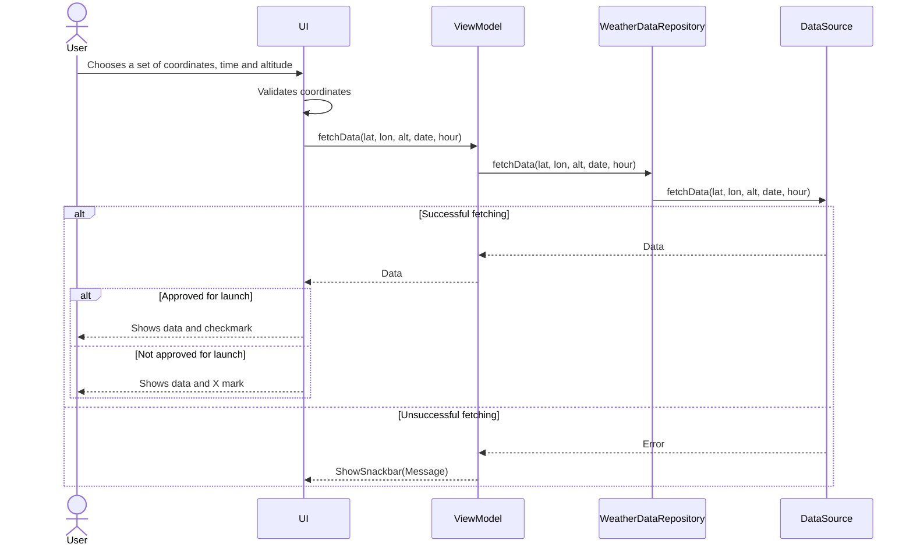

# Sequencediagram 

    
# Use Case 1

## Textual description of the use case

**Primary actor**: User: A person who wants to obtain a weather forecast for a specific location, time, and altitude to check if it is possible to launch a rocket.  
**Precondition**: The user must have access to the application, and the UI must be ready to receive user input.  
**Postcondition**: The user has been presented with the desired information for the selected location, time, and altitude, along with a result indicating whether it is possible or not to launch a rocket.  

**Main flow**:
<ol>1. User chooses a set of coordinates, time and, if wanted, altitude. Presses search. </ol>
<ol>2. System validates coordinates</ol>
<ol>3. System fetches forecast data</ol>
<ol>4. Returns forecast data for the given informations</ol>
<ol>5. Shows a checkmark if it is possible to launch a rocket</ol>

**Alternative flow**:  
<ol>2.1: The coordinates does not get validated </ol>
<ol>2.2: User retypes valid coordinates </ol>
 
<ol>3.1 System fail to fetch data</ol>
<ol>3.2 Returns error</ol>
<ol>3.2 Show snackbar to user</ol>
 
<ol>5.1 Shows an X mark if it is not possible to launch a rocket</ol>  
